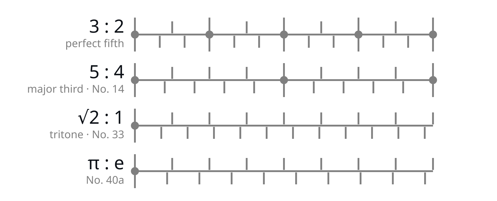

# Rhythm–Pitch Continuum

A [Max/MSP demonstration](patch/demo1-rhythm-intervals.maxpat) of Henry Cowell's “relationship of rhythm to sound-vibration”, created as part of the lecture on Conlon Nancarrow.

<picture>
  <source media="(prefers-color-scheme: dark)" srcset="assets/img/rhythm-ratios-dark.svg">
  
</picture>

## Henry Cowell on rhythm and pitch

> “Here, however, only one general idea will be dealt with—namely, that of the relationship of rhythm to sound-vibration, and, through this relationship and the application of overtone ratios, the building of ordered systems of harmony and counterpoint in rhythm, which have an exact relationship to tonal harmony and counterpoint” (Cowell 46).

> “Time has been translated, as it were, into musical tone. Or, as has been shown above, a parallel can be drawn between the ratio of rhythmical beats and the ratio of musical tones by virtue of the common mathematical basis of both musical time and musical tone” (Cowell 50–51).

> “Corresponding to the tone interval of a major third would be a time-ratio of five against four notes” (Cowell 51).

## Max patch description

Two hard-panned click trains with repetition rates *f* and *f·r* (a rate ratio *r*) produce rhythmic structures at approximately 2 Hz. When accelerated into the audible range, the same frequency relationship is perceived as a musical interval, illustrating Henry Cowell's concept from *New Musical Resources* (1930).

For rational ratios, the click trains coincide periodically (e.g. 3:2, 5:4). Irrational ratios, such as √2:1 and π:e, share only the initial click and never coincide again.

**Max patch:** [`patch/demo1-rhythm-intervals.maxpat`](patch/demo1-rhythm-intervals.maxpat), no version-specific objects, tested in Max 9. [Max](https://cycling74.com/downloads) is free to download and runs patches without a license.

**Slides:** [Sound (Art & Technology)](https://teaching.medienkunst-sound.de/sound_art_and_technology/), HfG Karlsruhe.

## Works Cited

Cowell, Henry. *New Musical Resources*. 1930. Preface and notes by Joscelyn Godwin, Something Else Press, 1969.

## License

© 2026 Lorenz Schwarz, HfG Karlsruhe

Licensed under the Creative Commons Attribution 4.0 International (CC BY 4.0) License.
